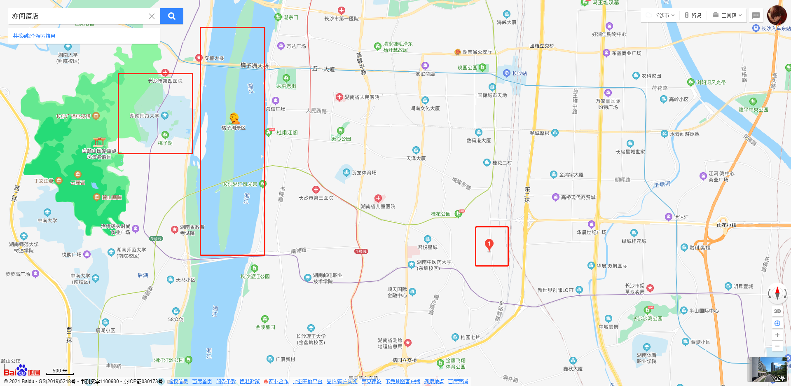
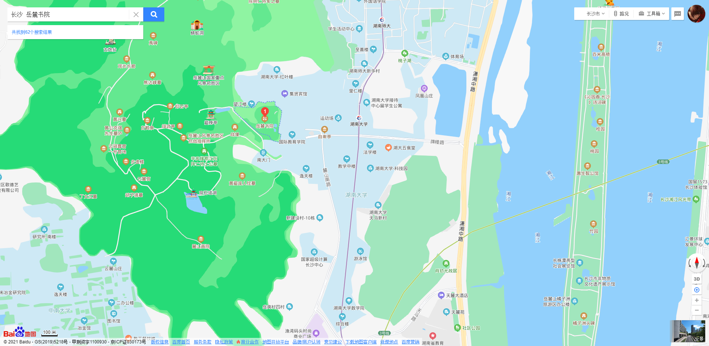
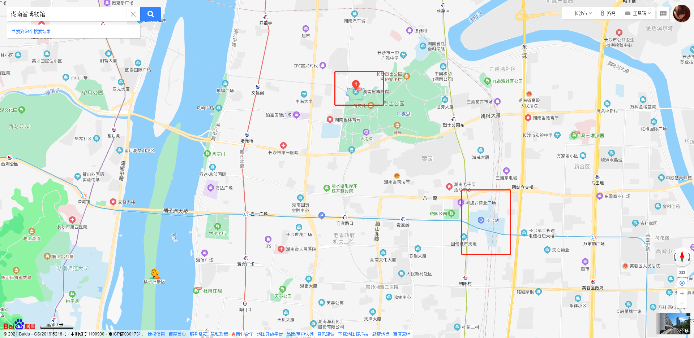

# Welcome to ChengtcDocs

## 五一出行计划

### 行程概览
目的地|时间|天气|同行
--|:--:|--:|--:
长沙|1-3号|待定|ttc，黄泉，兔子，汽水，无邪

---
### 愿望清单
 - 亦间酒店 【湖南省长沙市雨花区车站南路161号】
 -  
 - 橘子洲 (湖南省长沙市岳麓区橘子洲头2号)
 - 岳麓书院 (湖南省长沙市岳麓区麓山南路(湖南大学内)
 - 烟花 （在橘子洲）
 - 
 - 摩天轮
 - 口味虾 （一号晚上解决）
 - 湘菜 （一号中午解决）
    - 谢光头辣椒炒肉，娟娟餐馆，超级文和友[果呀呀,茶颜悦色]，长郡中学门口小吃，老师傅餐馆（内线推荐餐馆）
 - 湖南省博物馆-->解放西路
 - 

 [长沙哪里有好吃的早点？](https://www.zhihu.com/question/54173439)
 [第一次去长沙全攻略](https://m.mafengwo.cn/mmobile/guidepolymeric/detail?id=1110000008477146461)
 ---
### 出行前准备
<!--  -->
1. 证件齐全
    - 身份证
    - 学生证（吃饭优惠？）
    - 银行卡？
    - 少量现金
    - 长沙的app？（地铁...）
    ***
2. 行李件数
    - 拉杆箱（20寸）
    - 双肩包
    - 钱包/卡包
    ***
3. 衣物准备（五天）
    - 牙刷（充电）
    - 牙膏
    - 洗面奶 
    - 沐浴液？（民俗提供？）
    - 洗发水？（民俗提供？）
    - 换洗内衣（按天）n
    - 袜子 5双
    - 薄外套？ 1件
    - T-恤 4件
    - 睡衣 1套
    - 充电线 5根（apple*2，iWatch，typC，充电宝）
    - 充电宝 1
    - ipad
    - 耳机
    - 扩展插座？
    - 口罩 10*2
    - 湿纸巾 *2
---
### 行程规划
#### --五月一号
- 08:00 起床 收拾自己 准备出门（个人习惯早点出门赶高铁 你们自己看时间安排）  
- 09:30 高铁出发长沙
- 11:00 抵达长沙
- 11:20 滴滴（的士）打车前往酒店
    - 存放行李到前台
- 12:00 湘菜特色（下面是长沙人推荐的 当然也可以自己选）
    - 谢光头辣椒炒肉，娟娟餐馆，长郡中学门口小吃，老师傅餐馆
- 下午 岳麓书院 + 湖南大学（橘子洲因为有烟花可能会封，建议想看要么吃完饭就去橘子洲 或者之后几天再去）
    - 湖大旁边很多小吃可以看看
- 晚上 附近口味虾
- 观看 烟花 （好像是1900开始）
- 
#### --五月二号
- 08:00 起床 收拾自己（玩累可以多睡会）
- 09:00 长沙特色早餐 米粉
- 09：30 湖南省博物馆
- 12:00 湘菜特色
- 下午 岳麓书院
- 晚上 
- 观看 烟花
#### --五月二号
- 08:00 起床 收拾自己
- 09:00 早餐 [长沙哪里有好吃的早点？](https://www.zhihu.com/question/54173439)
- 09：30 湖南省博物馆
- 12:00 湘菜特色
- 下午 解放西路
- 晚上 
- 观看 烟花